# English to Dotfile

## Overview

This skill converts English requirements into a valid Attractor `.dot` graph.

Core principle:
- Prefer a validated template and minimal edits over novel graph design.
- Optimize for a graph that runs reliably, not a graph that looks clever.

Primary references for behavior:
- `docs/strongdm/attractor/ingestor-spec.md`
- `docs/strongdm/attractor/attractor-spec.md`
- `skills/english-to-dotfile/reference_template.dot`

## When to Use

Use this skill when:
- The user wants a DOT pipeline from plain English requirements.
- The output target is `kilroy attractor ingest` or `kilroy attractor run`.
- You need to choose models/executors and routing structure safely.

Do not use this skill when:
- The user asked you to implement software directly instead of generating a DOT graph.

## Non-Negotiable Rules

1. Programmatic output must be DOT only.
- Output starts with `digraph` and ends with `}`.
- No markdown fences, preambles, or sentinel strings.

2. Never emit non-DOT terminal responses in programmatic mode.
- Do not output `NEEDS_CLARIFICATION`, `DOT_VALIDATION_FAILED`, or similar text as final output.
- If uncertainty remains, choose best-evidence assumptions and still emit DOT.

3. In non-interactive/programmatic mode, do not ask follow-up questions.
- Resolve ambiguity from repository evidence and continue.
- Default to `medium` option behavior when selection is needed.

4. Ensure every codergen node resolves a provider/model.
- For `shape=box`, `llm_provider` and `llm_model` must resolve via explicit attrs or `model_stylesheet`.

5. Honor explicit topology constraints.
- If user says `no fanout` or `single path`, do not emit fan-out/fan-in branches.

## Workflow

### Phase 0: Determine Execution Mode and Constraints

Determine mode first:
- Interactive mode: conversation with user where you can ask one disambiguation question if needed.
- Programmatic mode: CLI ingest or any machine-parsed context where you cannot ask questions.
- If unsure, treat as programmatic mode.

Extract hard constraints from user text:
- Required providers/models
- Parallelism intent (`no fanout`, `3-way`, `consensus`)
- Executor intent (`cli` vs `api`)
- Cost/quality intent (`fast`, `max thinking`, etc.)

### Phase 1: Resolve Ambiguity with Repo Evidence

Use a short repo triage before asking anything:
- Inspect top-level structure and obvious docs.
- Search ambiguous tokens with `rg`.
- Prefer concrete repo evidence over guesswork.

Interactive ambiguity rule:
- Ask at most one disambiguation question when required to proceed.
- Ask only identity/meaning questions, not preference questions.

Programmatic ambiguity rule:
- Do not ask questions.
- Use strongest evidence, record assumptions in graph prompts/artifacts, and continue.

### Phase 2: Select Topology (Template-First)

Default strategy:
- Start from `skills/english-to-dotfile/reference_template.dot`.
- Keep one code-writing implementation node.
- Use parallelism for planning/review thinking stages, not code writes.

Constraint fast path (`no fanout`):
- Use a compact single-path loop.
- Keep `implement -> check_implement -> deterministic verify/check -> semantic verify/review -> postmortem`.
- Do not include `plan_a/b/c`, `review_a/b/c`, `component`, or `tripleoctagon` nodes.

Spec source rule:
- If user provides an existing spec path in repo, reference that path directly.
- If requirements are vague and no spec exists, include `expand_spec` early so runtime nodes can create `.ai/spec.md`.

Loop and routing rules:
- Keep explicit outcome-based conditions (`outcome=...`).
- Inner retry restarts (`loop_restart=true`) are only for transient infra failures (`context.failure_class=transient_infra`).
- Deterministic failures should route to repair/postmortem, not blind restarts.
- For `goal_gate=true` nodes routing to terminal, use `condition="outcome=success"` or `condition="outcome=partial_success"`.

Guardrails:
- Do not set `allow_partial=true` on the primary implementation node in the hill-climbing profile.
- Do not add `max_agent_turns` by default.
- Do not add visit-count loop breakers by default.

### Phase 3: Select Models and Executors

#### 3.1 Read Preferences Defaults

Load preferences in this order:
1. Skill-local sibling file: `skills/english-to-dotfile/preferences.yaml` (repo path).
2. If skill runs from an agent-skill directory, also check sibling `preferences.yaml` next to `SKILL.md`.

Use values as defaults only:
- `defaults.models.default|hard|verify|review`
- `executor` (`cli` or `api`)

#### 3.2 Detect What Is Executable

For each provider, determine usable execution paths:
- OpenAI, Anthropic, Google/Gemini: API and/or CLI.
- Kimi, Zai, Minimax, Cerebras: API availability.
- Include providers configured in run config.

Do not select providers that are not executable in the current environment.

#### 3.3 Resolve Candidate Models from Kilroy ModelDB/OpenRouter Catalog

Catalog preference order:
1. Run-config `modeldb.openrouter_model_info_path` or run snapshot.
2. `internal/attractor/modeldb/pinned/openrouter_models.json`.
3. Explicit user model IDs when catalog is unavailable.

Interpretation rules:
- Treat catalog as metadata guidance, not a strict allowlist.
- Honor explicit user model IDs when feasible.
- `current`/`cheapest` are computed from currently executable candidates.

#### 3.4 Build Option Set

Define three plans:
- Low: lowest-cost viable plan, reduced parallelism.
- Medium: default plan, balanced quality/cost, template-aligned.
- High: strongest available plan, cross-provider fan-out when available.

Interactive mode:
- Present low/medium/high once and wait for selection/overrides.

Programmatic mode:
- Do not print options table.
- Choose medium automatically and continue.

Encoding rule:
- Put model/provider assignments in `model_stylesheet`.
- If high mode uses fan-out, assign distinct providers to `branch-a`, `branch-b`, `branch-c` when possible.

### Phase 4: Write Node Prompts and File Handoffs

Every generated codergen prompt must include:
1. What to do.
2. What files to read.
3. What files to write.
4. Acceptance checks.
5. Explicit outcome contract.

Mandatory status contract text (or equivalent) in generated prompts:
- Write status JSON to `$KILROY_STAGE_STATUS_PATH` (absolute path).
- If unavailable, use `$KILROY_STAGE_STATUS_FALLBACK_PATH`.
- Do not write nested `status.json` files after `cd`.

Failure payload contract:
- For `outcome=fail` or `outcome=retry`, include both `failure_reason` and `details`.
- For deterministic verification failures, include `failure_class` where applicable.

Handoff rules:
- Use `.ai/*` files for substantial inter-node artifacts (plans, reviews, postmortems).
- Keep file reads/writes consistent: every read path must have an upstream producer or explicit repo-source justification.

Verification scoping rules:
- Scope required checks to project/module paths.
- Scope linting to changed files vs `$base_sha`.
- Treat unrelated pre-existing lint failures as non-blocking for feature verification.

Artifact hygiene:
- Fail verification if feature diffs include build/cache/temp artifact paths unless explicitly required by spec.

### Phase 5: Validate and Repair (Required)

Before final output:
1. Ensure no unresolved placeholders remain (`DEFAULT_MODEL`, `HARD_MODEL`, etc.).
2. Re-check explicit user constraints (especially `no fanout`).
3. Re-check file handoff integrity.
4. Re-check failure routing guards on check nodes.

Validation loop (max 10 attempts):
- Run Graphviz syntax check when available:
  - `dot -Tsvg <graph.dot> -o /dev/null`
- Run Kilroy validator:
  - `./kilroy attractor validate --graph <graph.dot>`
  - or `go run ./cmd/kilroy attractor validate --graph <graph.dot>`
- Apply minimal edits per diagnostics and retry.

If still failing at attempt 10:
- Programmatic mode: emit best-repaired DOT only.
- Interactive mode: report failure diagnostics clearly.

## Reference Skeleton

Use this as baseline shape (adapt node names as needed):

```dot
digraph project_pipeline {
  graph [
    goal="...",
    rankdir=LR,
    default_max_retry=3,
    retry_target="implement",
    fallback_retry_target="debate_consolidate",
    model_stylesheet="
      * { llm_model: DEFAULT; llm_provider: DEFAULT_PROVIDER; }
      .hard { llm_model: HARD; llm_provider: HARD_PROVIDER; }
      .verify { llm_model: VERIFY; llm_provider: VERIFY_PROVIDER; }
      .branch-a { llm_model: A; llm_provider: A_PROVIDER; }
      .branch-b { llm_model: B; llm_provider: B_PROVIDER; }
      .branch-c { llm_model: C; llm_provider: C_PROVIDER; }
    "
  ]

  start [shape=Mdiamond]
  exit  [shape=Msquare]

  implement [shape=box, class="hard"]
  check_implement [shape=diamond]

  verify_build [shape=parallelogram]
  check_build [shape=diamond]

  review_consensus [shape=box, goal_gate=true]
  postmortem [shape=box]

  start -> implement
  implement -> check_implement
  check_implement -> verify_build [condition="outcome=success"]
  check_implement -> implement [condition="outcome=fail && context.failure_class=transient_infra", loop_restart=true]
  check_implement -> postmortem [condition="outcome=fail && context.failure_class!=transient_infra"]
  verify_build -> check_build
  check_build -> review_consensus [condition="outcome=success"]
  check_build -> postmortem [condition="outcome=fail"]
  review_consensus -> exit [condition="outcome=success"]
  review_consensus -> postmortem [condition="outcome=retry || outcome=fail"]
  postmortem -> implement [loop_restart=true]
}
```

## Quick Reference

### Shapes

| Shape | Handler | Purpose |
|---|---|---|
| `Mdiamond` | start | Entry node (exactly one) |
| `Msquare` | exit | Exit node (exactly one) |
| `box` | codergen | LLM task |
| `diamond` | conditional | Routes prior outcome only (no prompt execution) |
| `component` | parallel | Fan-out |
| `tripleoctagon` | parallel.fan_in | Fan-in |
| `parallelogram` | tool | Deterministic command/tool gate |

### Required Graph-Level Attributes

| Attribute | Why |
|---|---|
| `goal` | Runtime objective and prompt variable |
| `model_stylesheet` | Model/provider defaults per class |
| `default_max_retry` | Global retry ceiling |
| `retry_target` | Recovery target for unsatisfied goal gates |
| `fallback_retry_target` | Recovery fallback |

### Outcome Values

Canonical values:
- `success`
- `partial_success`
- `retry`
- `fail`
- `skipped`

Custom outcomes are allowed if prompts define them explicitly and edges route with `condition="outcome=<value>"`.

## Common Mistakes and Fixes

1. Emitting non-DOT text in programmatic mode.
- Fix: final output must be raw `digraph` only.

2. Asking users to pick options in non-interactive contexts.
- Fix: default to medium and continue.

3. Ignoring explicit `no fanout` constraints.
- Fix: emit single-path topology only.

4. Missing provider resolution on box nodes.
- Fix: ensure stylesheet or node attrs resolve `llm_provider` + `llm_model`.

5. Using labels instead of conditions for routing.
- Fix: route with `condition="outcome=..."`, not `label="success"`.

6. Allowing unguarded fail restarts in inner loops.
- Fix: restart only on `context.failure_class=transient_infra`; route deterministic failures elsewhere.

7. Missing status-file contract in prompts.
- Fix: always include stage status path + fallback + no nested status files.

8. Dangling artifact reads.
- Fix: every `.ai/*` read must have an upstream producer or repo-source justification.

9. Unscoped lint/build checks that fail on unrelated repo issues.
- Fix: lint changed files via `$base_sha`; scope required checks to target module/project.

10. Shipping unresolved model placeholders.
- Fix: replace placeholders with concrete model/provider assignments before emit.

11. Running code-writing fan-out in shared scope by default.
- Fix: keep implementation single-writer unless user explicitly requests isolated fan-out.

12. Overengineering topology from scratch.
- Fix: start from `reference_template.dot` and make minimal edits.

## Final Pre-Emit Checklist

- DOT output only (programmatic).
- User constraints applied (`no fanout`, provider/executor requirements).
- `model_stylesheet` resolved with concrete providers/models.
- All codergen prompts include full status contract.
- File handoffs are closed (no dangling reads).
- Validation loop passed, or best-repaired DOT emitted per mode rules.
